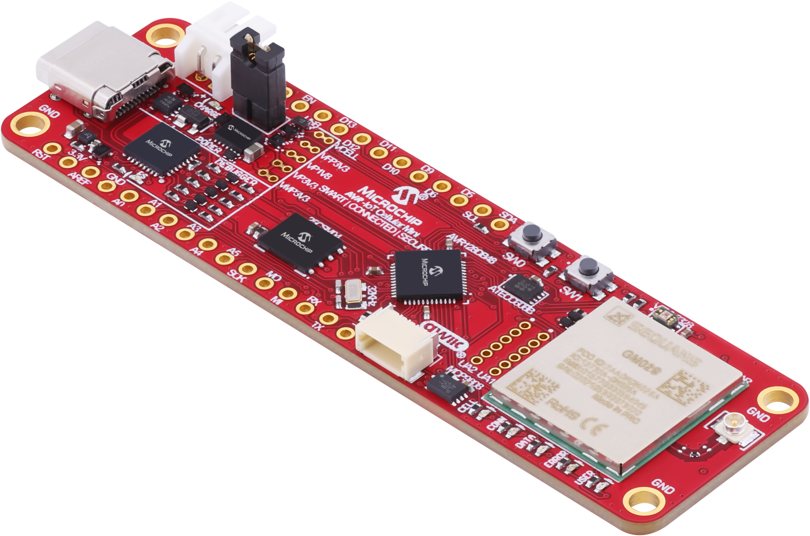
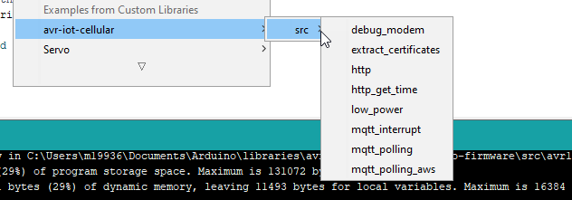

# AVR-IoT Cellular Arduino Library
[![GitHub release (latest by date)](https://img.shields.io/github/v/release/microchip-pic-avr-solutions/avr-iot-cellular-arduino-library?logo=data%3Aimage%2Fpng%3Bbase64%2CiVBORw0KGgoAAAANSUhEUgAAADAAAAAwCAYAAABXAvmHAAAACXBIWXMAAA7DAAAOwwHHb6hkAAAAGXRFWHRTb2Z0d2FyZQB3d3cuaW5rc2NhcGUub3Jnm%2B48GgAACc5JREFUaIHlmXtwVNUdxz%2B%2Fcze7ySbZPHkFoYENDwkwpVio2AqiolZ56tgZ30Jbp5axKAJCwfC2Su0gpeig0toi6piiFdTp0AFGRUWLVIsCgfCK8jIJkGSz2ce9p39s2Oyyrxsfnen0O3Nn7vnd3%2Fec3%2B%2Fc3%2F2d3zkX%2Fsch30QnurLS2RgIVFhKD1XoARZykYgUobXRPkibFk6LliNoc09QG%2F%2FqfvBgvYD%2BumN%2FZQd0ZaWzIRy4Dm3dBDIGKAOUzVFbRbNLa6qdYmzw1NTUJ9FSQBHQkL6rTuJ0ZXl3CTl%2BIeh7gG7pdLW2NcFtWljXJb9ohuzaFWqXXQQ8AFjAOeAxIJCMbNuBk0OH5jr8vhkIM4nMzDcM%2BWVpzcE17Y2pRMKrDPgCOADsSMay9cobB3gvc7T5PkRYKiJFIoKdq5NYcubiPt9pvz8JdAH%2BCZS0O5EUaR3QYHzZz%2FugpdkGXAyRsLB7dQ662DTVEzoSFW8C%2B9qNfxc4koqVcpp0ZaWzMdS2WsNPY%2FUiM6tBS7s09X2nfQDQ%2BsbSA4c22lVP6oAePjyrofnMOpDbEgidCI3OvwUA6pwqa5hn37602ec8EkJIg2poObsqmfEJEIlcXxEpvpVeIR1apm0mmAQHGvp770VzT3qaxjFyJJ7qjeSvfwFjUGVU3rE0pZ99o2dPcletJn%2F9BrIuHRU3EVozrb6i4nI7DsR5ebqiYphS1tsguSkJIqh%2B%2FfFseBGVnw%2BA1VDPuSmT0KdOxbuZIoQkLw%2FPSy9jeCsiAr%2BfpttvIbxnT6zap81B85I%2BR460pXMg%2Bgb0mDEOpawn0xkPoF0ucpc%2FguTlRbONFJfgnjcfrTNnKQD3nLmovt4OeXY27qrF4HTG6lbmOdXcdLbEOdB44tgdICMzEdz3zcBROThBnnXV1TjHjctEx3nNtThvvClBbgweTPYdd8YLNQ%2BeGtBnaLr%2BBOBweXl2vtPYA3jPMzuiq%2BPeceko8p9ZhxhG0s7M48dpmjwBfe5chHlBCBk9yvBUb0RKSpJb4%2FdzbuINmMeOxUrfKu3Z%2B0rZvj2cjKIA8pzGpA7jo37F3UtJCbnLHklpPIBRVkbOAzOTPhPDIHfZ8tTGA%2BTkkFu16MIxLm%2F4%2FNjPU1GUBhFkaupeAaXIXVCFUVaWVg3AddPNOC75frzxImTfdTeOUZdl5Dsu%2ByGuiZPiZFqxtMHr7ZXUtPoBA3qA%2FmG8WMfdS34%2Bjh9cmnFwiMy0%2B%2BEqcLliRlE4J022xQfImTkL1aVLrAlFptIrk60NxuzigvEi8pMLzIi%2FDwTQLS1kjR5jayVWJaVgmYQ%2F%2BKDdAI2uq8M5foKthU%2FcblTXLoS2bIm1YqCvuPDTFY1nP4sbS4RRGXsEAtUvE%2F7wQzuqAGRPnYbRv3%2B0HdrxDsFNr9nmO68fT9aP4tYyEZHHmwYOjPuIlCBJ0lQkhJzjJ8D5DyocpnVRFTqYdF%2BRAMlx4354IaIimVprTeuKx9ANtkocEME9fwEqLz9W2jtgBpfGCozZJcVLAM8FbLIuH03eylXo%2BnrM9hVSn2lElMIxYqS9UOpRhq6vJ7zn3xF%2Bqw%2Fd2IDzqqvt%2BVBQiDizCO%2BI28sMm1VSuH1F49mjEEmjXROIpaXkLlmGGAY5989Ede8efeZ%2F9hnMmv32DBAh51f3Y5SVRQu34KbXCO94x9aGSERw3Xo7xuAhsTJDiVp9vKzMfd6BrAtGJXfxUlS3yHZXFRTgnje%2F4%2BNra6N1ySJ0OOm6kgBVVIR7ztwOvmXhW7II3eqzNwlOJ7lVC8HhiBUPceVlzwIwZhUXLYydMdett5F9511xnRh9%2B2IdPED44AEA9IkTqJJSjCFDbBlheL2Y%2B%2Fdh1tZG%2BGfPgmnaWhcAVNdu0NJMaPdHUZmGETO7Fm2SL%2Fv19QFuAMfAi%2FFseBHc7oRO9MmTnJsyEauxMdKpx4Pnb5tRPXrYMsI6cZymieOxmpoAEKcLzwsvYiSpq5LC18K5KZMwjx6NdWKLMbukaCpQLNnZ5D%2B1FtUj%2BWoreXkoTwHBbVsj5EAA6%2FgXOK%2F7sb3cnp%2BP5LgJv%2F1WRGCaWDX7cU2c3JHp0sHpxOjdm9Cbb3B%2Br6o0rcbs4qJrRUk%2F95yHyLryqrR9GIMGEd79EVZdHQDWkcM4KiowKvplNgBwDKok%2FP57WCdORPgnT6IKC3B8d5gtvlFejnXkcEcSUXq3EpGPssZcgeuWzDtIRMiZfl80hWrLwveb5ZGYtuWBA%2FfDVYgrOyry%2F34V1uef2%2BPTvpcoLo40tHrXmHfFWJX32Io7JD8%2FPfM8tEXg%2BfVgWZFmSws0N5N1xVhbdFXaBfythHftivCDQay6OpzX32C%2FzCgsIrRtaxBlTVcF1dXvSrduJ%2BxZD8FNmxJSaKD6ZcIf7LTbBTn3Tsco6xlth7ZvI%2Fj6Ztt85%2BQpZI0d%2B2bp%2FsM1SkRagVfsEM1P9%2BBfszpBrk2T1sULwe%2B3ZYBZW4vV2FFSRMqMR9GNNssMpch99LdrBbSKtNXTgJmW1NKCb84sdCB5LWTW1uJ%2Fem3mwQMBfPPnotvi9%2BrWqVP4f%2Fe4PQfggOHx%2FAM69sQfi8gbKdW1xrd8KeGDB9OoaNqefQZz3960I%2FufWIm5b1%2FSZ4G%2FVhN%2B%2F70MtgPwuIgEod0BEdEisgAIJdMOvr6Z4KuZo0wH2iKhZCZ%2FmeGdO2n7y3Mpj1u01rQuWQytremG2auU%2BtP5RvRUQkQ%2BBhIC3Kqri9Q%2B7VknE8K7dxN4YUOicS3N%2BObPQ4eSzlEU5qFa%2FGufSvnYsqwZIhKN47iTOaVUFfBJVBAM4pszC6v9lMEOtNb4V62MLlbtQvyPLMesO5aaGMNv%2B%2BM6zL1JQ%2FEPDodjS6wgzgERaVZK3QqcAfCvWU04poCyC6upCd%2B8h9DNzaA1gT8%2FR%2BAV2wfO6EAgIRS11juUUnNFJC7%2Bkq4coVBonLXz%2FVebfzYtx27ZfCFEBCkpQQoLsQ4dsh2CsXz3rxfguu12gBql1GgROZmgl6qDhhGXTLPOND4FOFLpfNtQngI81Rv3O8rLx4lI0vhLu3af7ue9S9BrgJxvxcLM%2BCyrV%2FmEwq1ba1MpZCw%2BvqwoH42o9UT%2BHP43scllOO%2FO9KPD1k%2BEk15vV0PpJ4Cbsfsv%2BKvjrIheUFJz%2BEnJVB3Qid%2BsGqSxos%2FVlpLlaL7XGa5NtGn0S4alFpTU1tbZJXXaCD18eFZ905lrBJmOcCVf%2FyM%2FC%2Fp5sFaX1hxJXmOkwdeaxQavt5c2rIlayzhgBFAKZNofBoFjAm8Dm8M5vr93%2F%2BSUvSOKJPjGwuBARYWrQOteWkyvIBeJqGK0dhM55msWdL0lHBWHdaB079HTduL7%2FwL%2FAZqJ1CYE5LswAAAAAElFTkSuQmCC&style=flat-square)](https://github.com/microchip-pic-avr-solutions/avr-iot-cellular-arduino-library/releases/latest)

## Installation Instructions

The recommended way to install the library is within the Arduino IDE. Simply go Tools -> Manage Libraries and search for "avr-iot". The library can also be cloned from this repository. More information can be found [here](https://iot.microchip.com/docs/arduino/introduction/devenv).

## Board Description

The [AVR-IoT Cellular Mini](https://www.microchip.com/en-us/development-tool/EV70N78A) is a development board from Microchip to develop cellular IoT applications.

📓 Full Arduino support through a library built on top of the open-source [DxCore](https://github.com/SpenceKonde/DxCore)

🔒 All the basic building blocks to create secure IoT applications (AVR Microcontroller, Secure Element and a Cellular Modem)

⚡ Free 150MB 90-Day SIM Card from [Truphone](https://truphone.com), providing coverage across many countries

📡 Bundled Antenna in the Box

🐞 On-Board Debugger, no need for any external tools

🔋  Battery Charging Circuitry with Connectors

☁️ Complete AWS Support with easy provisioning through the [IoT Provisioning Tool](https://github.com/microchip-pic-avr-tools/iotprovision-bin)

🤝 Built & Designed to be Familiar to Makers, featuring a [Adafruit Feather](https://learn.adafruit.com/adafruit-feather) form-factor and a [Qwiic](https://www.sparkfun.com/qwiic) / [Stemma](https://learn.adafruit.com/introducing-adafruit-stemma-qt) Connector

## 👉 *Documentation: https://iot.microchip.com/docs/* 👈

## Examples

A set of examples can be in [src/examples](./src/examples/), and in the respective user guides on the [documentation website](https://iot.microchip.com/docs/arduino/userguide/architecture).

## Sensor Drivers

The [AVR-IoT Celluar Mini](https://www.microchip.com/en-us/development-tool/EV70N78A) features two sensors. The drivers for these sensors can be found at the following locations

* Temperature Sensor - MCP9808
  * [Source Code](https://github.com/microchip-pic-avr-solutions/mcp9808_arduino_driver)
  * [Documentation](https://iot.microchip.com/docs/arduino/userguide/sensor-drivers/MCP9808)
* RGBCIR Sensor - Color Sensor
  * [Source Code](https://github.com/microchip-pic-avr-solutions/veml3328_arduino_driver)
  * [Documentation](https://iot.microchip.com/docs/arduino/userguide/sensor-drivers/VEML3328)

Some examples featured in this library use these sensor drivers. Specifically the sandbox and low power examples. To compile said examples, both sensor driver libraries must be installed.
